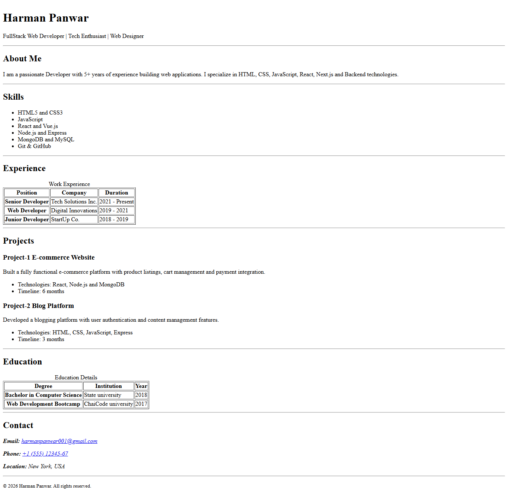

# Resume Webpage (HTML Only)

This project is a simple resume webpage built using only HTML, with a focus on semantic structure, accessibility, and proper document organization.
No CSS or JavaScript has been used, as per the assignment requirements.

## Use of Semantic HTML

Semantic HTML elements are used to clearly define the structure and meaning of the content. This improves readability, accessibility, SEO, and helps screen readers interpret the page correctly.

`<header>`

Used to contain the main heading and professional summary of the resume. It represents introductory content for the webpage.

`<main>`

Wraps the primary content of the resume, helping assistive technologies identify the main section of the document.

`<section>`

Each major part of the resume (About, Skills, Experience, Projects, Education, Contact) is wrapped inside a section tag to group related content logically.

`<article>`

Used inside the Projects section to represent individual projects as self-contained pieces of content.

`<footer>`

Contains contact information and copyright details, marking the end of the document.

`<address>`

Used to semantically represent contact information such as email, phone number, and location.

## Semantic Tables and Accessibility

Tables are structured using semantic elements to improve accessibility and screen reader support.

`<table>, <thead>, <tbody>`

These elements define the structure of tabular data and separate table headers from the body content.

`<th>` with scope attribute

The scope="col" attribute is used on table headers to indicate that they apply to their respective columns, helping screen readers correctly associate data cells with headers.

`<caption>`

Each table includes a caption element that describes the purpose of the table. Screen readers announce the caption before reading table data, providing better context.

## Accessibility Considerations

- Semantic HTML improves compatibility with screen readers

- Proper heading hierarchy (h1 → h2 → h3) is maintained

- Clickable mailto: and tel: links are used for contact details

- Tables include captions and scoped headers for accessibility

## Assignment Constraints

- HTML only

- No CSS

- No JavaScript

- Focus on semantic structure and accessibility